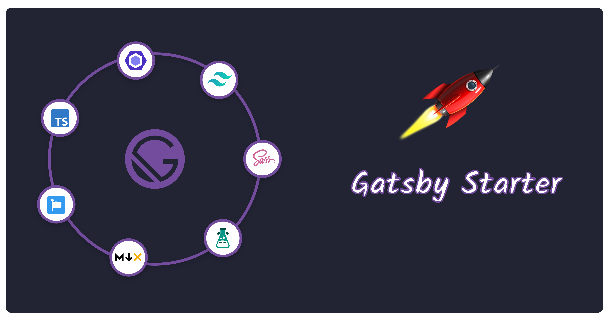

<p align="center">
    
</p>

<h1 align="center">
    Gatsby Starter
</h1>

<p align="center">
    <a href="https://tailwindcss.com/">Tailwind CSS</a>
    ·
    <a href="https://www.typescriptlang.org/">TypeScript</a>
    ·
    <a href="https://sass-lang.com/">SASS</a>
    ·
    <a href="https://eslint.org/">ESLint</a>
    ·
    <a href="https://stylelint.io/">Style Lint</a>
    ·
    <a href="https://fontawesome.com/">Font Awesome</a>
    ·
    <a href="https://react.i18next.com/">React i18next</a>
    ·
    <a href="https://testing-library.com/docs/react-testing-library/intro/">React Testing Library</a>
    ·
    <a href="https://cypress.io/">Cypress</a>
    <br>
</p>

<p align="center">
    A fully loaded starter kit for Gatsby development to get your website up and running in minutes.
    <br>
    Code quality & Testing tools are also already configured for your ease.
</p>

<!-- ALL-CONTRIBUTORS-BADGE:START - Do not remove or modify this section -->
[](#contributors-)
<!-- ALL-CONTRIBUTORS-BADGE:END -->

## 🔗 Quick Links

| [Demo](https://html-starter.netlify.com) |
| ---------------------------------------- |

## 🚀 Quick start

> The generated project have dependencies that require `node`, `npm` and `Gatsby CLI`.

**Make sure you have [Node](https://nodejs.org/en/download/) version >= 8.0, [npm](https://www.npmjs.com/) >= 5 & [GatsbyCLI](https://www.gatsbyjs.com/docs/tutorial/part-0/#gatsby-cli)**

```bash
# create a new Gatsby site using this template.
gatsby new my-gatsby-starter https://github.com/brionmario/gatsby-starter

# change the directory
cd my-gatsby-starter/

# start the development server. Site will run on http://localhost:8000
npm start

```

## Table of Contents

- [File Structure](#file-structure)
- [Getting Started](#getting-started)
  - [Prerequisites](#prerequisites)
  - [Setting Up](#setting-up)
  - [Running the app](#running-the-app)
- [Styling](#styling)
- [Linting](#linting)
- [Deployment](#deployment)
  - [Gatsby Cloud](#gatsby-cloud)
- [Contributing](#contributing)
- [Contributors](#contributors)
- [License](#license)

## File Structure

```
gatsby-starter/
 ├── coverage/                      * unit test coverage reports.
 ├── cypress/                       * cypress tests folder.
 ├── docs/                          * contains documents and document resources.
 ├── i18n/                          * contains i18n translations and config.
 ├── node_modules/                  * contains dependencies pulled from npm.
 ├── public/                        * generated public folder for distribution.
 ├── src/                           * source folder
 │   ├── assets/                    
 │   │   ├── images/                * images and icons.
 │   │   └── styles                 * SASS stylesheets.
 │   ├── components                 * shared reusable components.
 │   ├── layouts                    * app layouts.
 │   ├── models                     * typescript schemas.
 │   ├── pages                      * app pages.
 │   └── types                      * custom typings.
 ├── static                         * contains static assets that needs to be copied to public folder.
 ├── .eslintignore                  * files and folders that need to be ignored from linter.
 ├── .eslintrc.js                   * es-lint configuration file.
 ├── .gitignore                     * contains files that are ignored from git
 ├── gatsby-browser.js              * where Gatsby expects to find any usage of the Gatsby browser APIs.
 ├── gatsby-config.js               * main configuration file for a Gatsby site.
 ├── gatsby-node.js                 * where Gatsby expects to find any usage of the Gatsby Node APIs
 ├── gatsby-ssr.js                  * where Gatsby expects to find any usage of the Gatsby server-side rendering APIs.
 ├── CONTRIBUTING.md                * project contributing guidelines
 ├── cypress.json                   * cypress configuration file.
 ├── LICENSE.md                     * licensing information.
 ├── package.json                   * contains all the npm scripts for building, running, deploying etc. and contains all the dependencies
 ├── package.lock.json              * lock file for npm.
 ├── postcss.config.js              * post-css configurations.
 ├── README.md                      * Readme file for the repository
 ├── tailwind.config.js             * tailwind CSS configuration file.
 ├── stylelint.config.js            * style lint configuration file.
 └── tsconfig.json                  * typescript configuration file.

```

## Getting Started

### Prerequisites

What you need to run this app:

#### Node & npm

> Make sure you have `Node.js` and `npm` installed by running the following simple commands on the command line and see if you're running the latest stable versions.

- Node.js - Type `node -v` on the terminal.
- npm - Type `npm -v` on the terminal.

If you do not have them installed, click [here](https://nodejs.org/en/download/) and grab the latest stable version of `node` and `npm` will be automatically installed along with it. Or if you have `brew` already installed in your local machine, execute `brew install node` command to get `node`.

#### Gatsby CLI

Follow the Gasby CLI [install instructions](https://www.gatsbyjs.com/docs/tutorial/part-0/#gatsby-cli) and get it installed on your environment.
This will enable the usage of `gatsby` command.

### Setting Up

#### Create a Gatsby site

Use the Gatsby CLI to create a new site, specifying the default starter.

```bash
# create a new Gatsby site using this template.
gatsby new my-gatsby-starter https://github.com/brionmario/gatsby-starter
```
#### Navigate to source

Navigate into your new site’s directory and start customizing.

```bash
# change the directory
cd my-gatsby-starter/
```

### Running the app

You can execute the below command to fire up the server.

```bash
npm start
```

Your site is now running at `http://localhost:8000`!

_Note: You'll also see a second link: _`http://localhost:8000/___graphql`_. This is a tool you can use to experiment with querying your data. Learn more about using this tool in the [Gatsby tutorial](https://www.gatsbyjs.com/tutorial/part-five/#introducing-graphiql)._

## Styling

The `index.scss` file inside the `src/assets/styles` directory is the main stylesheet for the project and will be compiled by Gatsby's build.
If you want to add your own stylesheet, you can place it under the `src/assets/styles/partials` folder and import it in the `index.scss` file.

For example if you want to include the styles for a slider:

1. Create a `_slider.scss` partial file in the `src/assets/styles/partials` directory.
2. In `index.scss` add `@import 'partials/slider.scss';`

## Linting

Execute the following commands to generate linting for styles and scripts.

```bash
# all
npm run lint

# JavaScript & Typescript files.
npm run lint:es

# Style files.
npm run lint:styles
```

## Testing

### All Tests

Execute the following command to run both unit test suite and e2e test suite.

```bash
npm run test
```

### Unit Tests

Execute the following command to run your unit tests.

```bash
npm run test:unit
```

The following command will run the unit tests in watch mode.

```bash
npm run test:unit:watch
```

If you want to generate the code coverage for the project, use the following command.

```bash
npm run test:unit:coverage
```

> We have used [React Testing Library](https://testing-library.com/docs/react-testing-library/intro/) for unit testing.

### End-To-End Tests

Execute the following command to run your unit tests.

```bash
npm run test:e2e
```

> We have used [Cypress](https://www.cypress.io/) for E2E testing.

## Build

Execute the following command to build your app in production mode.

```bash
npm run build
```

## Deployment

### Gatsby Cloud

Deploy this starter with one click on [Gatsby Cloud](https://www.gatsbyjs.com/cloud/):

[](https://www.gatsbyjs.com/dashboard/deploynow?url=https://github.com/brionmario/gatsby-starter)

## Contributing

Please read [CONTRIBUTING.md](./CONTRIBUTING.md) for contributing guidelines and to learn about our code of conduct.

## Contributors ✨

Thanks goes to these wonderful people ([emoji key](https://allcontributors.org/docs/en/emoji-key)):

<!-- ALL-CONTRIBUTORS-LIST:START - Do not remove or modify this section -->
<!-- prettier-ignore-start -->
<!-- markdownlint-disable -->
<table>
  <tr>
    <td align="center"><a href="http://www.brionmario.com"><br /><sub><b>Brion Mario</b></sub></a><br /><a href="https://github.com/brionmario/gatsby-starter/commits?author=brionmario" title="Code">💻</a> <a href="https://github.com/brionmario/gatsby-starter/commits?author=brionmario" title="Documentation">📖</a> <a href="#infra-brionmario" title="Infrastructure (Hosting, Build-Tools, etc)">🚇</a> <a href="#maintenance-brionmario" title="Maintenance">🚧</a></td>
  </tr>
</table>

<!-- markdownlint-restore -->
<!-- prettier-ignore-end -->

<!-- ALL-CONTRIBUTORS-LIST:END -->

This project follows the [all-contributors](https://github.com/all-contributors/all-contributors) specification. Contributions of any kind welcome!

## License

This project is licensed under the BSD Zero Clause License(0BSD) License - see the [LICENSE.md](LICENSE.md) file for details.
